# T05:Connexió via SSH

El primer que farem serà crear dues màquines virtuals: una amb Windows i l’altra amb Linux (Ubuntu). La primera interfície serà NAT i la segona serà Host-Only.  

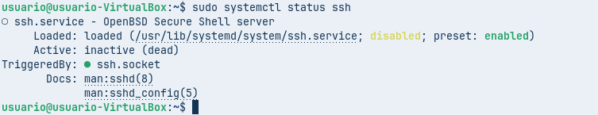

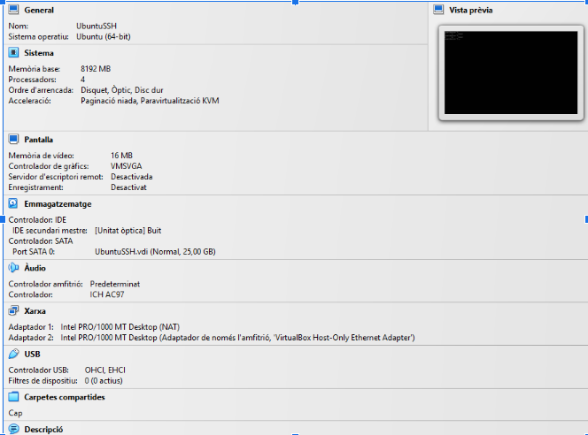

# SSH Linux

El primer que farem serà entrar a la màquina d’Ubuntu i executar la comanda : sudo apt install ssh

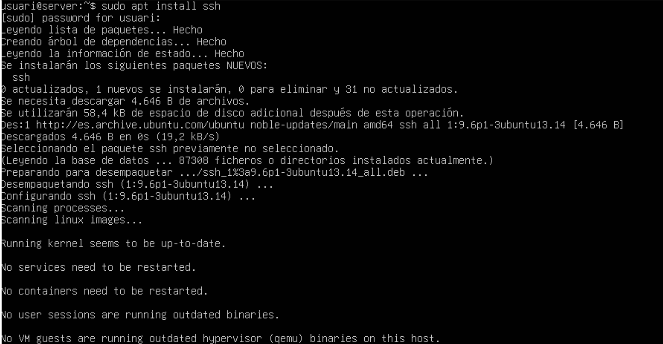

Com que l’hem posat des del principi, la xarxa es configurarà automàticament. Després la comprovarem amb la comanda `ip addr show` per veure la IP del servidor.  

I després comprovarem que l’SSH s’ha instal·lat correctament. 

Després, dins de la màquina de Windows, anirem a “Ver conexiones de red” per poder editar la configuració i, tot seguit, comprovarem que s’ha assignat correctament.

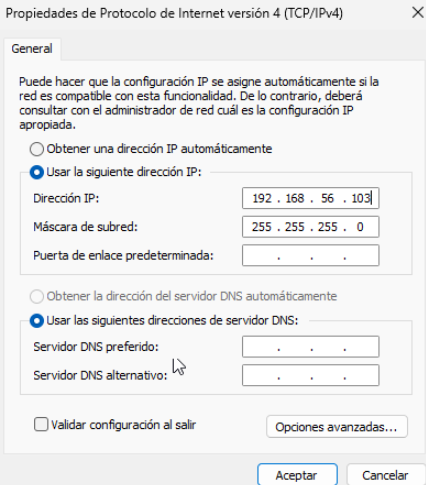 

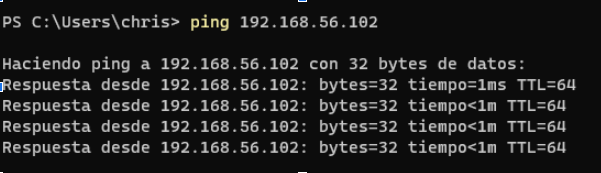

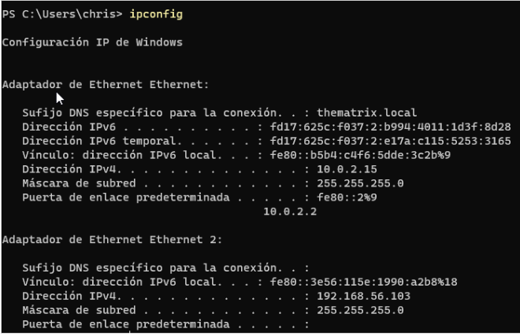

Després d’haver fet l’anterior, ja ens podrem connectar a la màquina d’Ubuntu des de la terminal de Windows. Quan ens ho demani, haurem d’acceptar amb `yes`. Finalment, farem la connexió amb la comanda `ssh nom@ip`.  

Després d’entrar, configurarem l’arxiu `/etc/ssh/sshd_config` amb l’editor `sudo nano`.

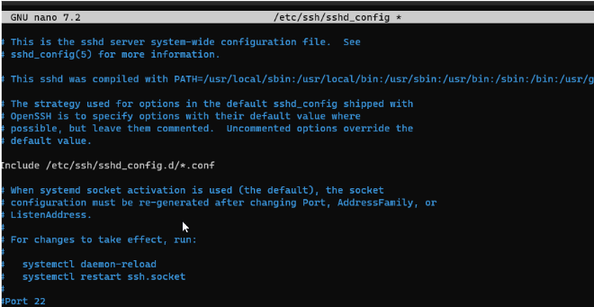

Després, dins l’arxiu, podrem configurar diferents opcions, com per exemple: permetre o denegar la connexió per a l’usuari root, canviar el port de connexió i definir la llista d’usuaris autoritzats per a connexió remota.

Per deshabilitar l’accés SSH per a l’usuari root, modificarem el mateix arxiu anterior i afegirem les línies corresponents.

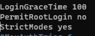  

Després, establirem una contrasenya per a l’usuari root amb la comanda `sudo passwd root`.  

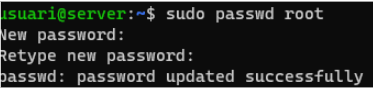

Després, intentarem connectar-nos per SSH com a root amb `ssh root@ip` i veurem que no ens deixarà.

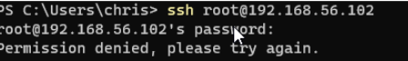

Però, localment, sí que podrem entrar com a root sense problemes.

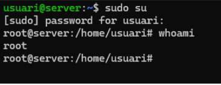

Després, per veure com permetre la connexió remota només a usuaris autoritzats, crearem un nou usuari anomenat `usuari2`.

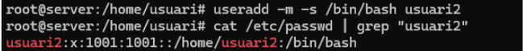

Després, establirem la contrasenya per a aquest usuari amb la comanda `passwd`.

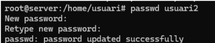

Després, haurem d’editar l’arxiu `sshd_config`.

I afegirem la línia `AllowUsers` amb el nom de l’usuari que volem autoritzar, en aquest cas `usuari2`. Tot seguit, ho comprovarem.

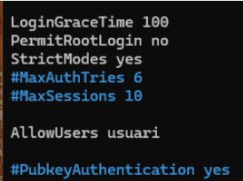

Finalment, reiniciarem el servei SSH per aplicar els canvis.

Comprovem que amb l’usuari autoritzat podem connectar-nos per SSH.

Després, comprovarem que l’usuari `usuari2` no es pot connectar, ja que no li hem donat permisos.

Finalment, com a últim pas, accedirem mitjançant un certificat en lloc d’utilitzar l’usuari i la contrasenya.  

Per fer això, el primer pas serà obrir el PowerShell del client i escriure la següent comanda: ssh-keygen -t rsa

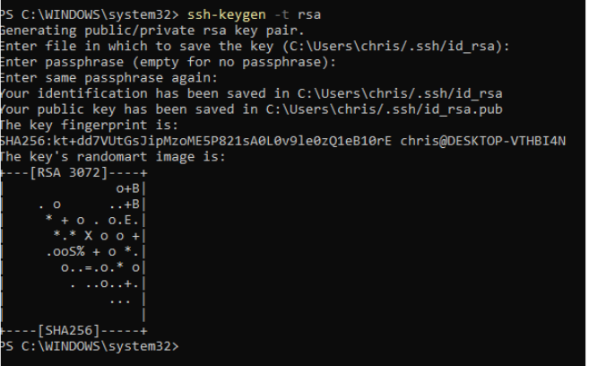

Després, entrarem a la carpeta `.ssh` i farem un `ls` per veure els fitxers que conté.

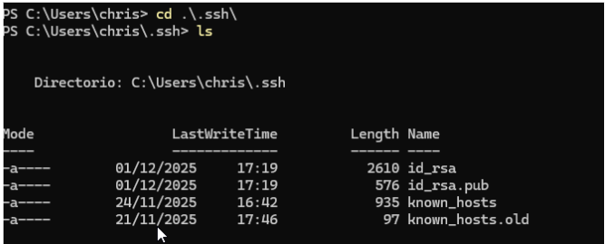

Farem un `cat` per llegir el contingut de la clau que s’ha generat.

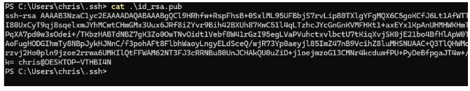

Copiem el contingut de la clau i fem un `scp` cap a `usuari@192.168.56.102`.

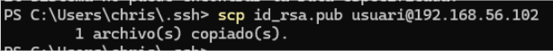

Després, entrarem dins de l’usuari i farem un `cat` a `/home/usuari/.ssh/id_rsa.pub` per comprovar que hem fet una còpia segura.

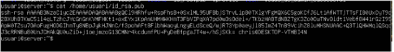

Després, transferirem la informació a `.ssh/authorized_keys`.

Ara veurem que podem entrar sense necessitat d’utilitzar cap contrasenya.

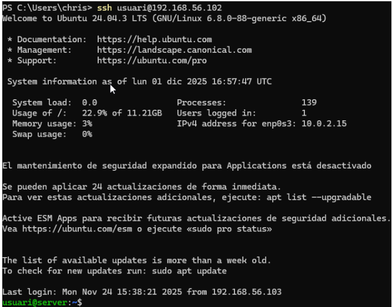

# SSH Windows

El primer serà instal·lar l’OpenSSH. Per això executarem la comanda següent: Add-WindowsCapability -Online -Name OpenSSH.Server

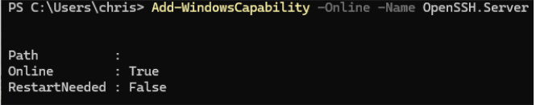

Després, iniciarem el servei amb la comanda: Start-Service sshd

Per fer que s’iniciï automàticament, executarem la comanda: Set-Service -Name sshd -StartupType Automatic

Després, comprovarem que des de la màquina Linux podem connectar-nos per SSH a la de Windows.

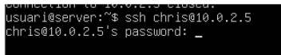  

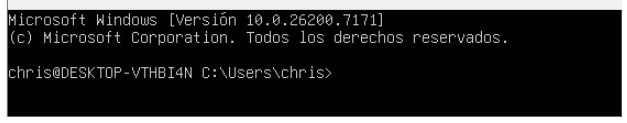

# Tunel

El primer serà instal·lar el Wireshark.

Entrem i comprovem que podem veure tot correctament.

Entrem a les propietats, a la secció de connexió.

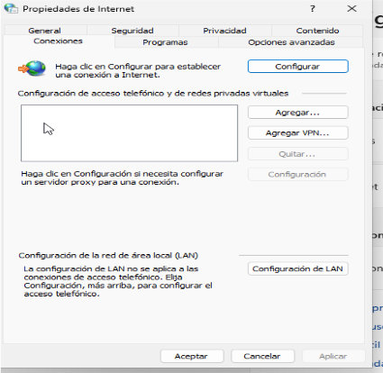

A la configuració de LAN, habilitem el servidor proxy i fem clic a “Opcions avançades” per configurar-lo.

A la configuració del proxy, establim el SOCKS a `127.0.0.1` i el port a `9876`.

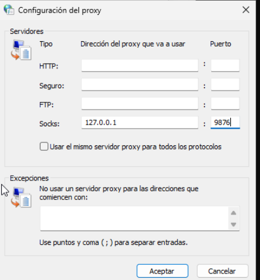

Després, connectem el túnel amb la comanda: ssh -D 9876 usuari@10.0.2.15

Desactivem el tallafocs perquè es pugui visualitzar.  
Això s’ha de fer abans de crear el túnel:

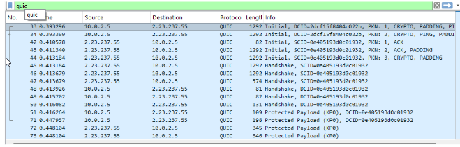

Després, activem el proxy.

Fem una cerca a Google i, tot seguit, obrim el Wireshark; haurem de veure com tot el tràfic passa pel túnel.  

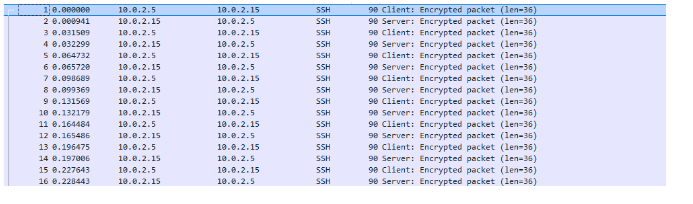

- [Tornar al enunciat](readme.md)
