# T05: Accés Remot. Connexió SSH

---

Es creen dues màquines virtuals: una amb Windows i una altra amb Ubuntu.

A la màquina ubuntu, configurem una interfície en NAT i l’altre en Host-Only.

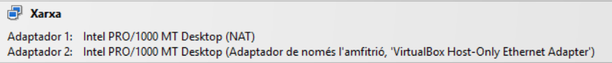

---
Modifiquem el netplan. : sudo nano /etc/netplan/50-cloud-init.yaml


---
Ara instal·lem el servei ssh. : sudo apt install ssh


---
Ens connectem al servei ssh: ssh usuari@192.168.56.101

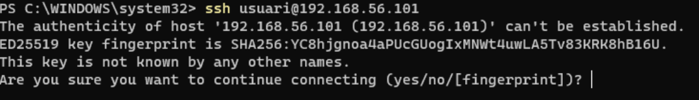

---
Ara comprovem que estem connectats al servidor des de la màquina client. Amb la comanda: hostname


---
Li posem contrasenya a l’usuari root: sudo passwd root

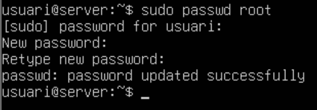

---
Entrem a l’arxiu /etc/ssh/sshd_config i afegim l’última línia.

sudo nano /etc/ssh/sshd_config

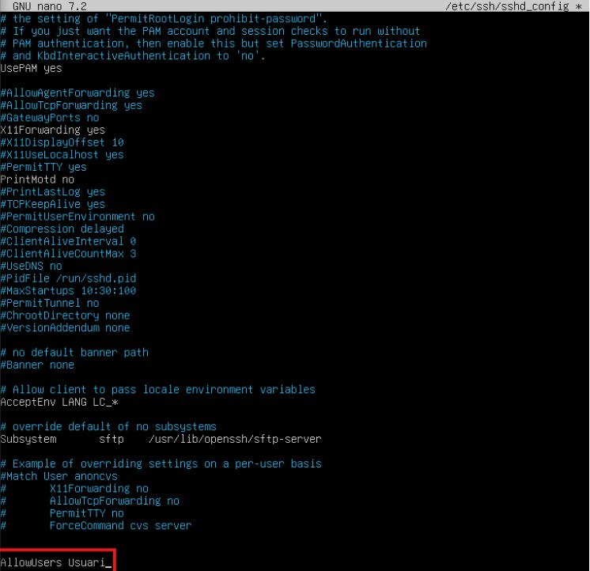

---
Entrem a l’usuari root amb “sudo - root” per comprovar que ens deixa i després sortim. 1: su - root 2:exit 

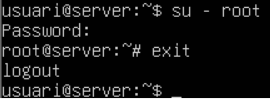

---
Intentem fer ssh des de la màquina client cap a l’usuari d’administrador del servidor i veurem com ens denega l’accés: ssh root@192.168.56.101

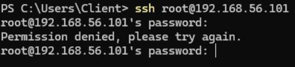

---
Des de la màquina client, introduïm la comanda “ssh-keygen -t rsa” perquè ens generi codis RSA: ssh-keygen -t rsa

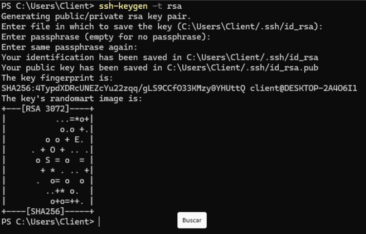

---
Amb la comanda “ls .\.ssh\” mirarem dins del directori de la carpeta ssh els arxius que hi ha creats, amb la data, el temps, mida i nom: ls .\.ssh\

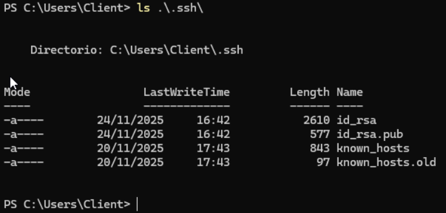
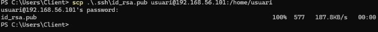

---
Dins de la carpeta ssh a la màquina del servidor, creem un arxiu: touch .ssh/authorized_keys


---
Copiem la clau que hem generat anteriorment a la carpeta ssh: cat id_rsa.pub >> .ssh/authorized_keys


---
Des de la màquina client, comprovem que podem fer ssh sense necessitat de la contrasenya: ssh usuari@192.168.56.101

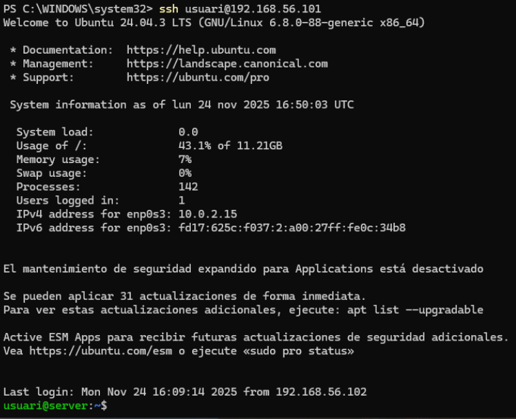

---
Per tenir el servidor OpenSSH hem d’anar a configuració, característiques opcionals i activar el client OpenSSH.

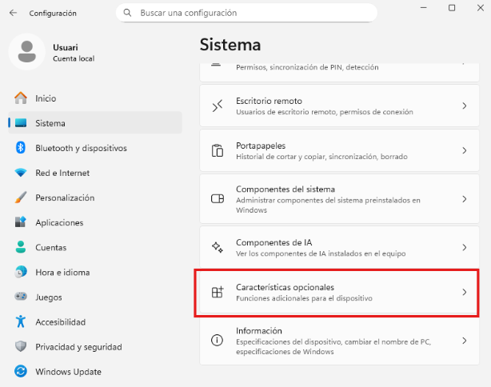
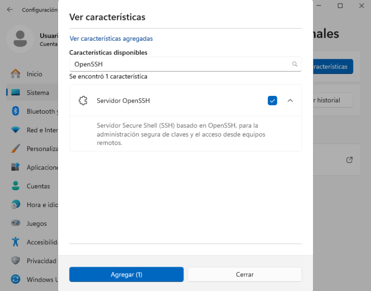

També podem instal·lar l'OpenSSH des del PowerShell, amb la seguent comanda: 
``
Add-WindowsCapability -Online -Name OpenSSH.Client~~~~0.0.1.0
Add-WindowsCapability -Online -Name OpenSSH.Server~~~~0.0.1.0
```
---

Desactivem el firewall, per això buscarem “Windows Defender Firewall” i seleccionarem l’opció de la configuració que es mostra.

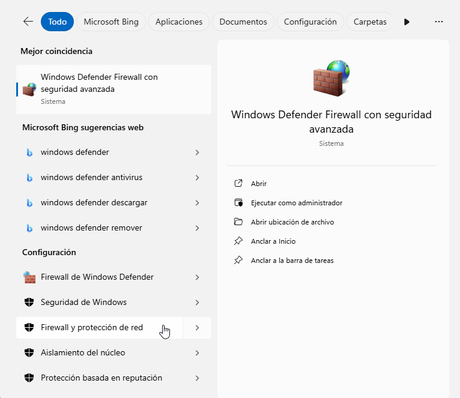

---
Entrem a xarxa pública.

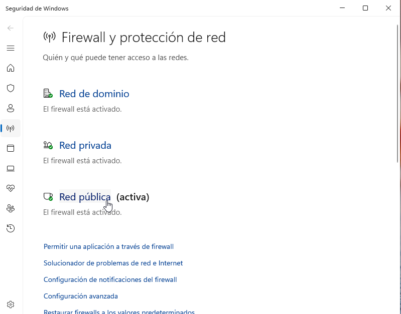

---
Desactivem el Firewall de Microsoft Defender.

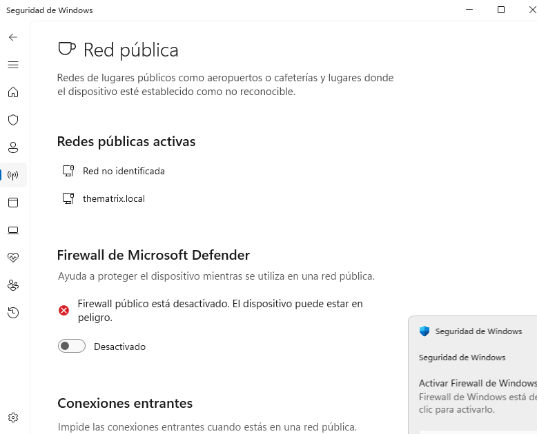

---
Executem com administrador el PowerShell.

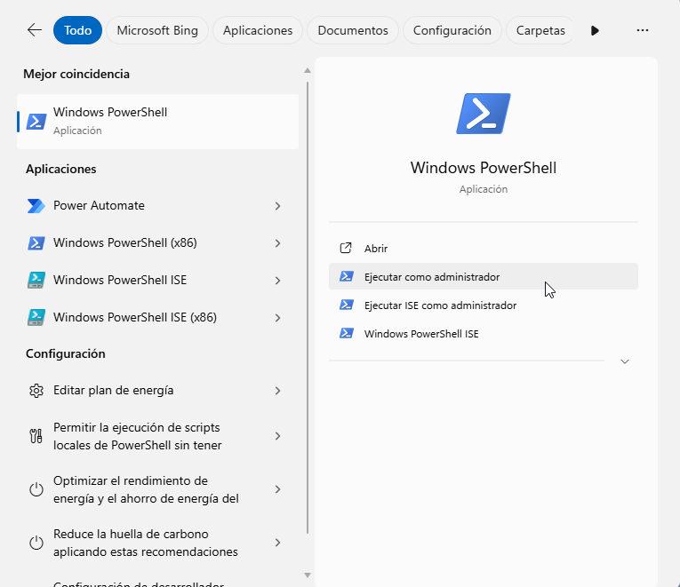

---
Iniciem el servei sshd: Start-Service sshd


---
Posem aquesta comanda perquè cada vegada que encenem la màquina s’inici el servei.

```
Set-Service -Name sshd -StartupType "Automatic"
```

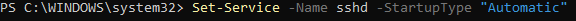

---
Fem ipconfig per veure l’ip de l’interfície Host-Only de la màquina ubuntu per poder-nos connectar.

```
ipconfig
```

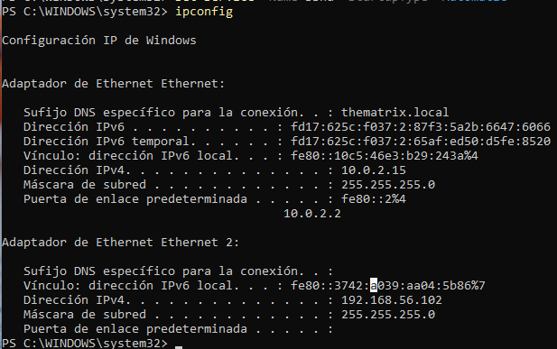

---
Fem un ping a la màquina client per comprovar que les dos màquines es veuen.

```
ping google.com
```

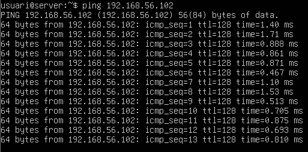

---
Ens connectem a la màquina client.

```
ssh -D 9876 usuari@192.168.56.101
```

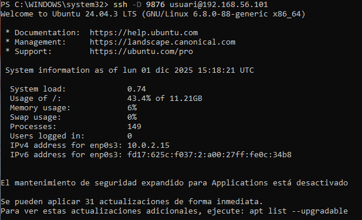

---
Per configurar el Proxy al Windows, primer hem d’anar al panell de control i a xarxes.


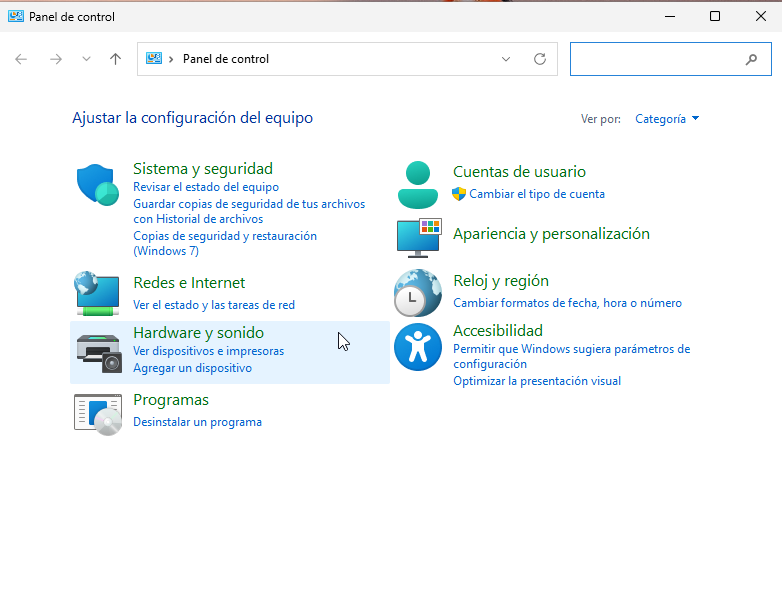

---
Anirem a opcions d’internet.


---
A dins, anem a connexions i a configuració de LAN.

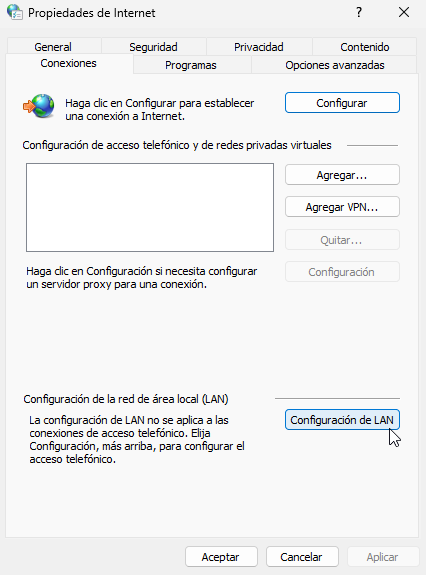

---
Habilitem el servidor proxy, i després anem a opcions avançades.

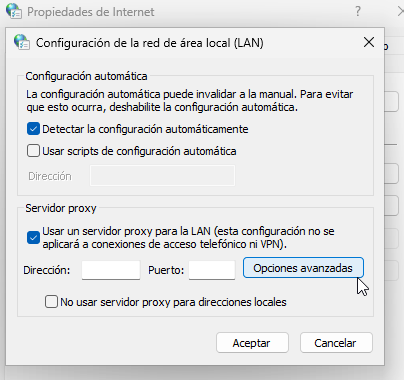

---
Posem l’IP local i el port amb el qual hem connectat el servei ssh.

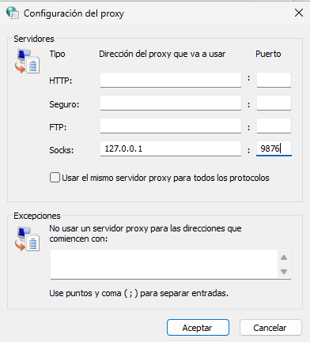

---
Comprovem els paquets en Wireshark.

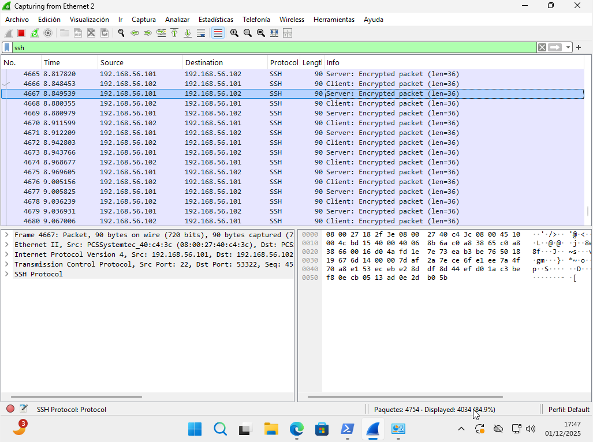

---
- [Tornar al enunciat](README.md)
