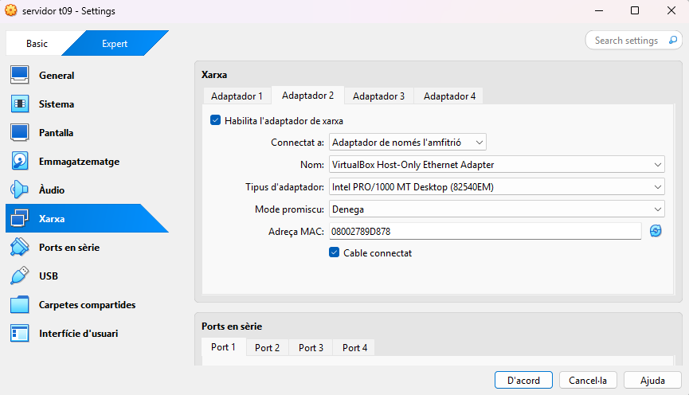
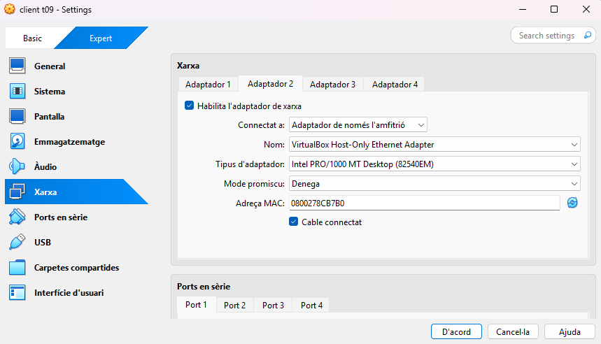

# Servidor NFS

Per començar, hem de crear 2 maquines virtuals, en aquesta practica hem de crear una maquina **ubuntu server** i una **zorin** per simular el **servidor i el client**.
Les dues maquines han d'estar en: la primera en **NAT** i la segona en **HOST ONLY**.

---
Un cop que ja tenim les dues maquines configurades començem configuran el servidor (ubuntu base)

La primera comanda que farem sera per actualitzar els paquets.
