# Servidor NFS

Per començar, hem de crear 2 maquines virtuals, en aquesta practica hem de crear una maquina **ubuntu server** i una **zorin** per simular el **servidor i el client**.
Les dues maquines han d'estar en: la primera en **NAT** i la segona en **HOST ONLY**.


---
Un cop que ja tenim les dues maquines configurades començem configuran el servidor (ubuntu base)

La primera comanda que utilitzarem servira per actualitzar els paquets.

```bash
sudo apt update && sudo apt upgrade -y 
```


Cuan hem executat la comanda, hem de tornar a executarla per comprobar que no quedin actualitzacions.

---
Un cop que ja tenim actualitzat tots els paquets i ho haguem comprobat, el seguent pas sera començar amb la creació de l'estructura de carpetas, de grups i usuaris.

El primer que farem sera crear els grups neccesaris, en aquest cas en demana que creem 2 grups, el primer **devs** i el segon **admin**

Per crear aquest grups farem la seguent comanda 

```bash
groupadd devs
```

```bash
groupadd admin
```
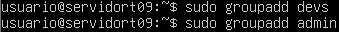

---
Per poder comprovar que els grups s'han creat correctament farem servir la comanda greep per buscar els 2 grups, el grup **devs** i el grup **admin**, hem d'entrar dins de l'arxiu /etc/groups, per fer-ho farem la seguent comanda:

```bash
grep devs /etc/group
```

```bash
grep admin /etc/group
```

En la qual com podrem veure en la captura els 2 grups d'han creat correctament

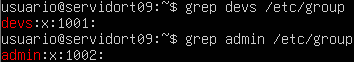

Un cop que ja tenim els grups creats el seguent pas sera crear l'usuari **dev01** que formi part del grup **devs**, per fer això farem servir la seguent comanda

```bash
useradd -G devs -m -s /bin/bash dev01
```

Per confirmar que esta creat l'usuari dev01 correctament fem servir el grep

```bash
grep dev01 /etc/passwd
```

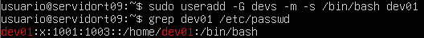

Un cop que ja tenim l'usuari dev01 el seguent pas sera crear l'usuari **admin01** que formi part del grup **admin**, per fer això farem servir la seguent comanda

```bash
useradd -G admin -m -s /bin/bash admin01
```

Per confirmar que esta creat l'usuari **admin01** correctament fem servir la comanda grep com anteriorment

```bash
grep admin01 /etc/passwd
```
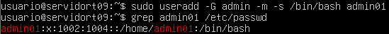

Un cop que ja hem creat els grups i els usuaris, el seguent pas sera crear el directori per als projectes de desenvolupament en la qual la ruta que ens demana és la seguent /srv/nfs/dev_projects, per crear les totes les carpetas d'una sola comanda farem el seguent:

```bash
mkdir /srv/nfs/dev_projects -p
```


Un cop fet això crearem el directori per a les eines d'administració en la qual la ruta sera /srv/nfs/admin_tools

```bash
mkdir /srv/nfs/admin_tools
```


Per ultim configurarem els permisos de les carpetas, en aquest utilitzare la comanda Chown per canviar la propietat de la carpeta.

```bash
chown root:devs /srv/nfs/dev_projects
```

```bash
chown root:admin /srv/nfs/admin_tools
```
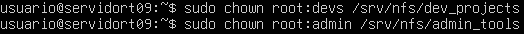

Un cop fet això hem d'assignar els permisos de la carpeta amb la comanda chmod 770

```bash
chmod 770 /srv/nfs/dev_projects
```

```bash
chmod 770 /srv/nfs/admin_tools
```

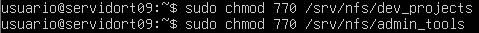

Per comprobar que els permisos estan correctament farem ls -l per poder veure els permisos de cada carpeta

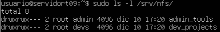

## Fase 2

Per poder continuar hem de crear els grups i usuaris dins de la maquina client (Zorin)
Per poder crear els grups i usuaris farem instalem la aplicació "users and groups"


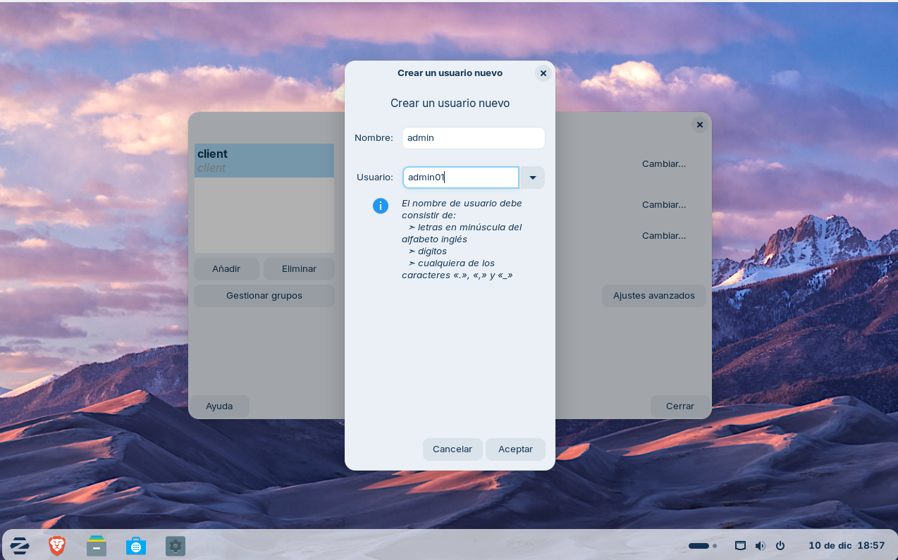

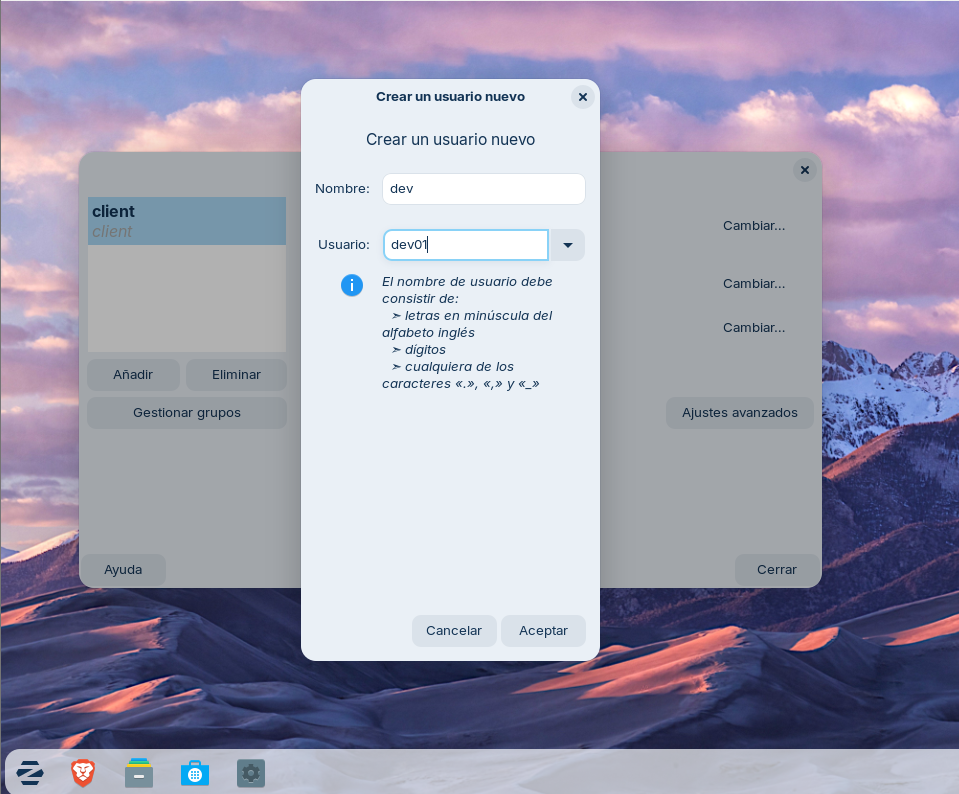

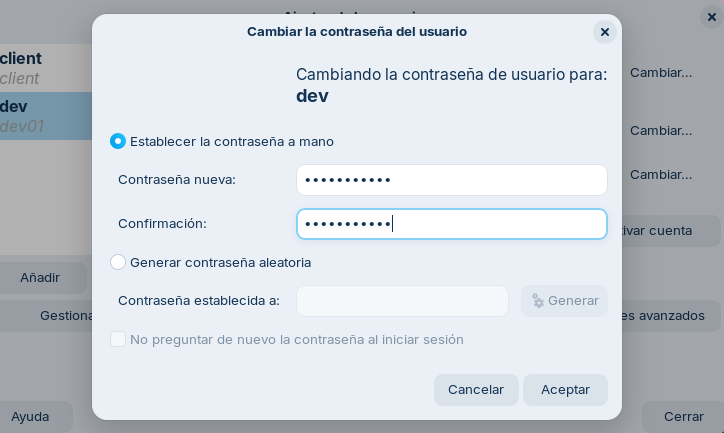

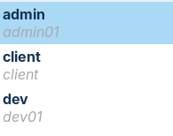

Hem de comprobar que els numeros UID i GID (els números d'identificació) coincideixin a les dues màquines.

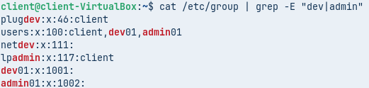

## Instal·lació i configuració del servei NFS

Ara instal·larem el servidor NFS amb la comanda:

```bash
sudo apt install nfs-kernel-server -y
```


I veiem que s'ha instal·lat correctament.

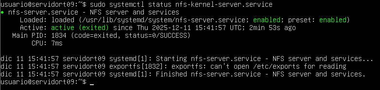

Ara caldrà configurar l'exportació dels directoris amb les opcions corresponents.

Per a fer-ho haurem de editar l'arxiu `/etc/exports`.

```bash
sudo nano /etc/exports
```

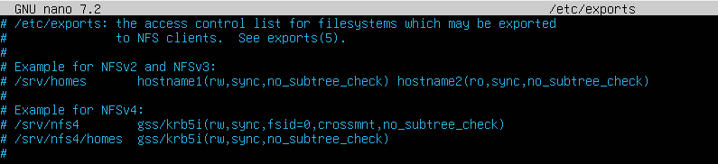


Afegirem una linia adicional al final del arxiu, en aquest cas sera la seguent 

```bash
/srv/nfs *(rw,sync,no_subtree_check)
```

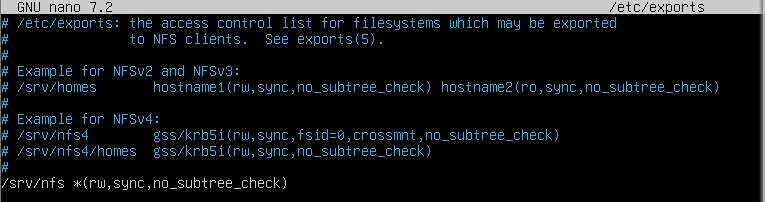

Per poder aplicar el canvis haurem de reinciar el servei amb la comanda

```bash
sudo systemctl restart nfs-kernel-server
```
Un cop fet això l'iniciem i comprobarem que tot funciona correctament 

En el servidor podem fer la comanda 

```bash
exportfs -u
```
Amb la qual podrem veure quins arxius es poden exportar

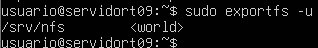

Tambe podem fer la seguent comanda per veure des-de quin port treballa, en aquest cas ho fa amb el port 2049

```bash
rpcinfo -p 192.168.56.103
```
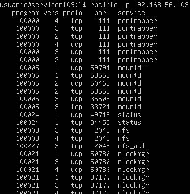

Per poder comprobar en la maquina haurem d'instalar el paquet nfs-common, això ho farem amb la seguent comanda en el client.

```bash
sudo apt install nfs-common -y
```

Un cop fet això en conectarem al servidor amb la comanda showmount -e IP

En el meu cas sera la seguent comanda 

```bash
showmount -e 192.168.56.103
```

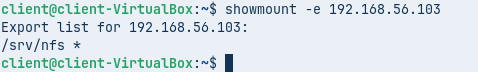

En la qual podem veure que la carpeta /srv/nfs

---

# Fase 3

A continuació farem una prova 1 (L'error comú)

Previament ja hem exportat l'arxiu /srv/nfs per tant el seguent pas que hem de fer sera muntar aquest recurs a la carpeta /mnt/admin_tools, en un principi aquesta carpeta no existeix, per tant el primer pas sera crear-la, això ho farem amb la seguent comanda

```bash
mkdir /mnt/admin_tools 
```

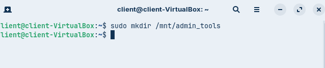

Un cop que tenim creada la carpeta, el seguent pas sera muntar el recurs, això ho farem amb la comanda mount 

```bash
mount -t nfs 192.168.56.101:/srv/nfs/admin_tools /mnt/admin_tools
```

Podrem veure no podem crear cap arxiu ja que no tenim els pemisos ja que el root de la maquina client i el root del servidor no es el mateix

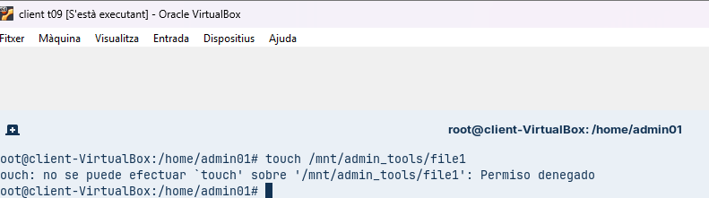

Mentre que si intentem crear un arxiu amb l'usuari admin si que podrem, ja que aquest usuari si que te permisos en aquesta carpeta

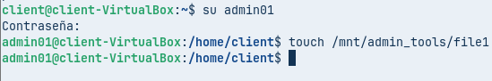

Podem veure que l'arxiu que hem creat es propietat de admin01

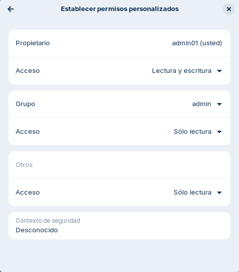

A continuació ensenyare com fer per poder crear arxius amb root

Prova 2 (La Solució)

Per començar haurem d'editar l'arxiu /etc/exports en el qual substituirem la linia que hem escrit previament per les seguents.

```bash
/srv/nfs/admin_tools *(rw,sync,no_subtree_check,no_root_squash)
/srv/nfs/dev_projects *(rw,sync,no_subtree_check)
```

Un cop fet això reiniciem el servei un altre cop amb la comanda 

```bash
systemctl restart nfs-kernel-server
```

A continuació haurem de desmuntar i muntar un altre cop el recurs, en el meu cas la comanda per desmuntar sera 

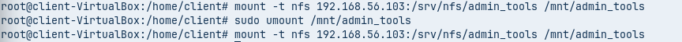

Un cop fet això podrem crear un now arxiu, per exemple en aquest cas he creat una arxiu anomenat file2

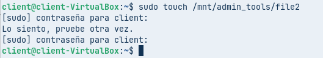

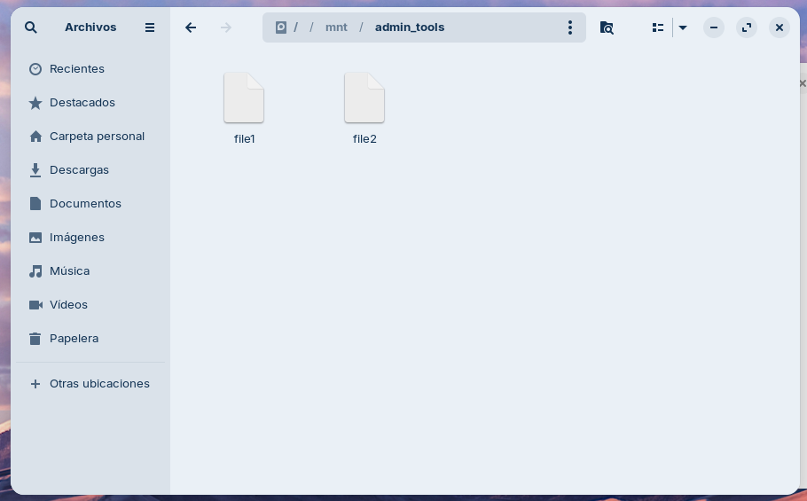

Això a causa de que hem modificat l'arxiu /etc/exports fent que el root de la maquina fisica sigui el mateix que el root del servidor, per tant tenim total llibertat 

---

# Fase 4

A continuació el client ens demana el seguent la xarxa d'administració (p.ex., 192.168.56.0/24) hi pugui escriure, però que la xarxa de consultors (p.ex., 192.168.56.100) només pugui llegir.

Per poder fer això haurem de modificar l'arxiu /etc/exports i substituir la linia "/srv/nfs/dev_projects *(rw,sync,no_subtree_check)" per les seguents 

```bash
/srv/nfs/dev_projects 192.168.56.0/24(rw,sync,no_subtree_check)
/srv/nfs/dev_projects 192.168.56.140(ro,sync,no_subtree_check)
```
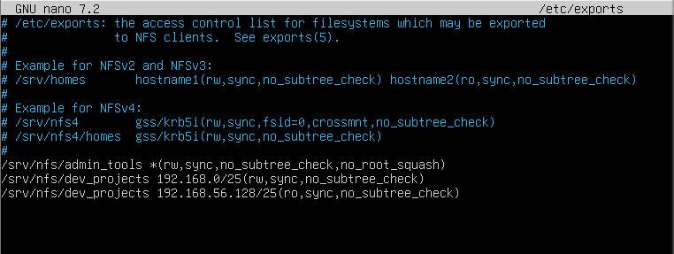

Això ho fem per poder assignar permisos depened de la ip que tingui l'usuari

Tot seguit reinciem el servei amb la comanda 

```bash
systemctl restart nfs-kernel-server
```

Un cop fet això haurem de muntar el disc dev_projects per comprobar que tot funciona correctament.

El primer pas sera crear la carpeta amb la seguent comanda

```bash
mkdir /mnt/dev_projects
```

El seguent pas que farem sera modificar la nostre ip, en aquest cas probarem amb la ip ```192.168.56.199``` per poder fer això anirem a la configuració de xarxa i colocarem la ip manualment i muntarem el disc

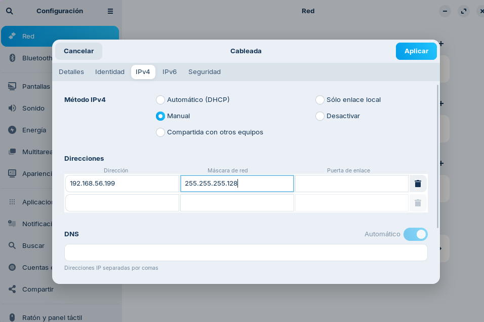

Ara per ultim fare login amb l'usuari dev01 i intentare crear un arxiu en la carpeta dev_projects

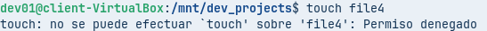

Podem veure que no podem crear cap arxius dins de la carpeta dev_projects ja que no tenim els permisos neccesaris ja que l'usuari dev01 no forma part del grup admin

---

# Fase 5


Ara per ultim modificarem l'arxiu /etc/fstab per poder configurar que els recursos compartits no es tinguin que muntar cada vegada que entrem

Per començar farem la seguent comanda per entrar al arxiu

```bash
sudo nano /etc/fstab
```

En el qual haurem d'afegir aquestes dues lines al final

```bash
192.168.56.103:/srv/nfs/admin_tools /mnt/admin_tools nfs defaults 0 0
192.168.56.103:/srv/nfs/dev_projects /mnt/dev_projects nfs defaults 0 0
```
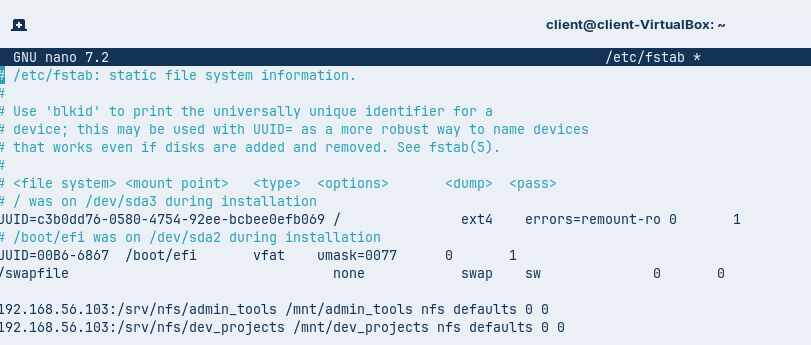

Un cop fet això reiniciem la maquina i confirmem que discos s'han muntat correctament 


---

# Conclusió

Per poder millorar aquest producte podriem millorar els seguents apartats, per exempla un dels problemes és que s'han de crear els usuaris i grups al servidor i a la maquina client, això no es optim ja que en un entorn real en el qual podrien haber més de 20 ordinadors de part del client. Basicament seria repetir el mateix pas 21 vegades (20 per els client i 1 per el servidor)

Una solució real per aquest problema seria centralitzar i fer un unic lloc en el qual hi hagin les dades per inicar sessió com per exemple LDAP aixì per evitar feina innecesaria.


